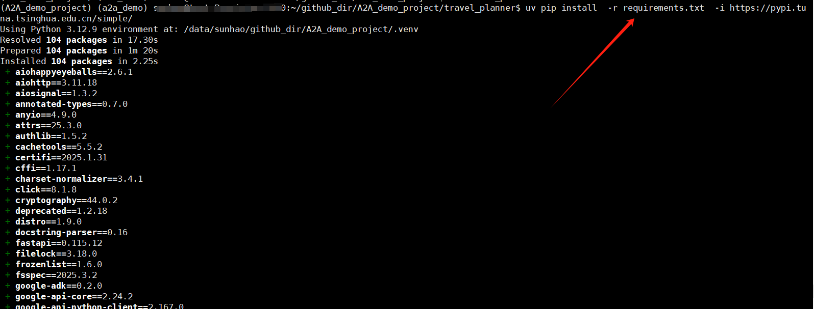
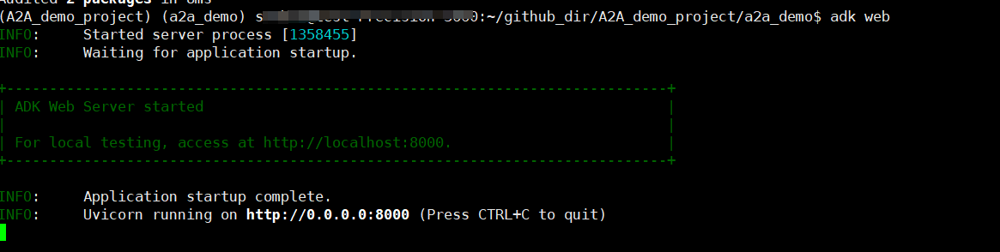
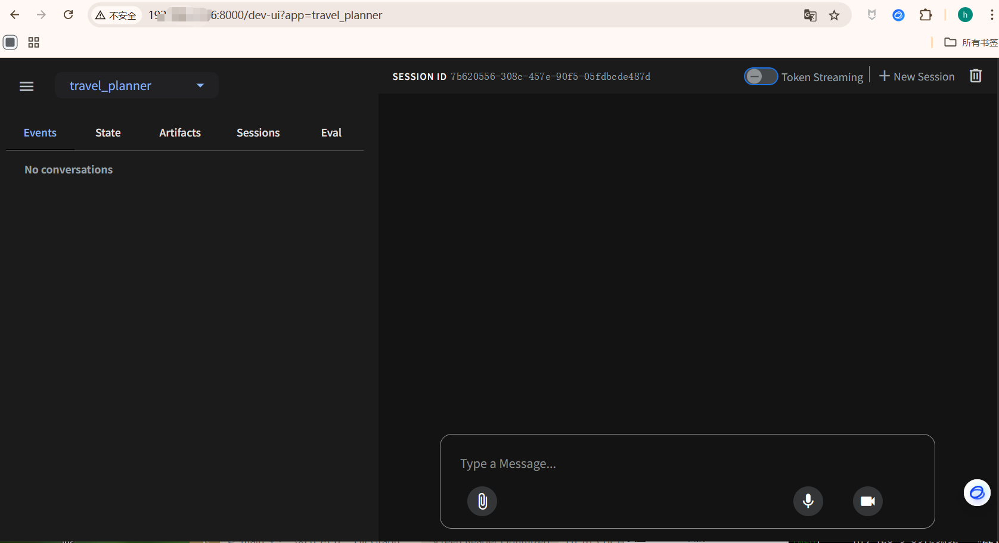
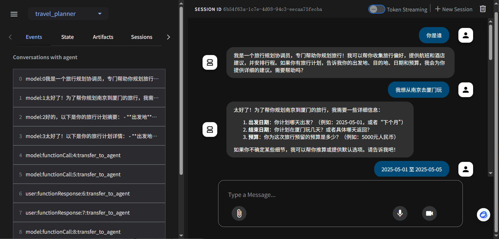
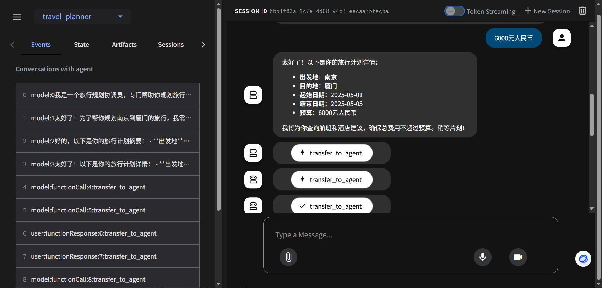
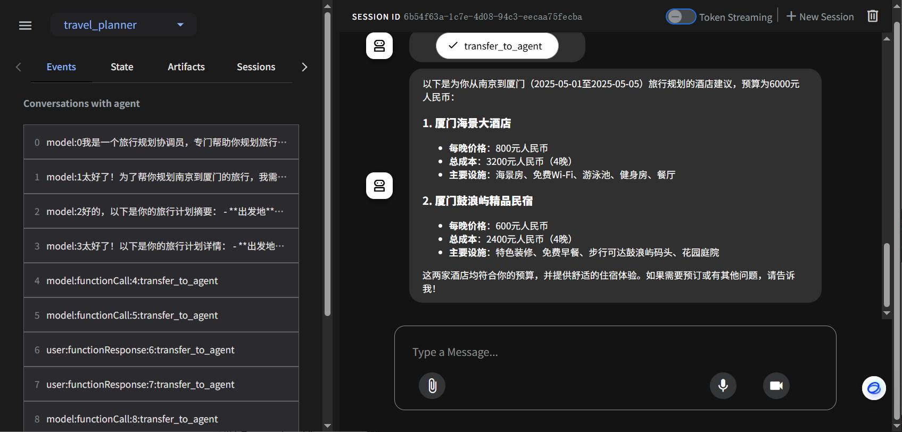

# A2A_demo_project
A2A实战示例，支持openai、deepseek、qwen的完整的酒店旅行示例


v1.0 版本 
支持openai、deepseek、qwen等大模型；
酒店旅行示例;


作者公众号： AI小新  ， 有问题，可以加群交流[大模型应用交流群]；关注公众号，发送数字2，获取小助手微信，拉你进群；

公众号：


# 下面开始部署教程

备注： 推荐在linux或者mac环境部署，win环境，打开A2A的网页端会有问题；


```bash
# 下载代码

git clone  https://github.com/aixiaoxin123/A2A_demo_project.git

```


# 进入代码目录
cd A2A_demo_project


# 创建conda环境

conda create -n a2a_demo  python=3.12

conda activate a2a_demo


# 安装uv 工具
pip install uv  -i https://pypi.tuna.tsinghua.edu.cn/simple/

uv --version


# 利用uv 在当前目录，创建一个虚拟环境

uv venv

# 激活虚拟环境
# linux 下命令
source .venv/bin/activate

# windows 下命令
.venv\Scripts\activate


# uv 安装对应的依赖包
```bash
# 进入代码目录

# 利用uv 安装依赖包
uv pip install  -r requirements.txt  -i https://pypi.tuna.tsinghua.edu.cn/simple/ 


```


截图：



# 配置 .env 文件，填入 deepseek的apikey


# 启动A2A 的webui服务

```bash

adk web

```

启动webdui的截图:



# 访问webui服务

http://127.0.0.1:8000


截图：



# 问答示例

截图：








